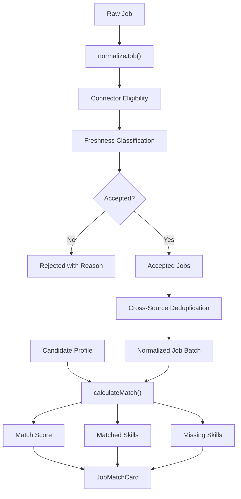

# Job Copilot

### Full-Stack Product Engineering · Job Ingestion · Matching · Application Workflows · AI-Assisted Career Intelligence

Job Copilot is a curated engineering showcase for a career workflow platform that combines **job-data ingestion, normalization, freshness controls, deduplication, candidate matching, application-state modeling, and AI-assisted product workflows**.

The broader private product is designed as a full-stack application spanning candidate onboarding, resume workflows, job discovery, application tracking, and interview preparation.

> **Public repository scope:** this repository contains recruiter-safe TypeScript/React examples, synthetic data, architecture notes, automated tests, and CI. The complete private product implementation, including its full web application and persistence layer, is maintained separately.

---

## Problem

A useful job platform needs to solve much more than “show a list of jobs.”

Real product engineering questions include:

- Can different job sources be normalized into one contract?
- Should every technically reachable source be allowed for automated import?
- How do we distinguish fresh listings from stale or unknown ones?
- How do we remove duplicates that arrive from different sources?
- Can employment arrangement be normalized from inconsistent text?
- How should a candidate-job match be explained?
- Can application state be represented explicitly?
- How do we keep AI assistance separate from deterministic product decisions?
- Can ingestion and matching behavior be tested independently from the UI?

Job Copilot treats these as **product, data-pipeline, reliability, and application-engineering concerns**.

---

## Product Model

The broader product flow is:

```mermaid
flowchart LR
    A["Job Sources"] --> B["Connector Policy"]
    B --> C["Normalization"]
    C --> D["Freshness Evaluation"]
    D --> E["Cross-Source Deduplication"]
    E --> F["Job Feed / Persistence"]
    F --> G["Candidate Matching"]
    G --> H["Resume Analysis"]
    H --> I["Job Review"]
    I --> J["Application Tracking"]
    J --> K["Interview Preparation"]
```



The public showcase focuses on the deterministic contracts around ingestion, reliability, matching, domain modeling, and a representative React component.

---

## Public Showcase Architecture



This architecture makes pipeline decisions explicit instead of hiding them inside UI code or external integrations.

---

## Publicly Implemented Capabilities

### Job Domain Contracts

The showcase defines typed domain models for:

- jobs
- candidate profiles
- application records
- employment types
- application lifecycle states

Application status is represented explicitly as:

```text
saved
applied
interview
offer
rejected
```

### Job Normalization

`normalizeJob()` converts loosely structured job input into a predictable `Job` contract.

Current normalization includes:

- whitespace cleanup
- default synthetic ID fallback
- employment-type normalization
- source attribution
- source URL normalization
- skill normalization
- optional posting timestamp preservation

Supported employment types include:

```text
full-time
part-time
contract
internship
unknown
```

### Connector Policy

Technical connectivity is not treated as automatic permission for ingestion.

The public `ConnectorPolicy` model evaluates:

- source status
- source risk
- allowed uses
- import eligibility

A source is eligible for governed import only when it is:

1. active
2. low risk
3. explicitly permitted for import

This separates **“we can connect to it”** from **“we should ingest from it.”**

### Freshness Classification

The public showcase classifies source observations as:

```text
fresh
stale
unknown
```

Freshness is derived from:

- the source observation timestamp
- the current time
- a configurable maximum age

Only `fresh` observations are treated as feed-ready in the simplified contract.

### Cross-Source Deduplication

Different sources can surface the same logical job.

The showcase builds a deterministic job fingerprint from normalized:

```text
company | title | location
```

Accepted jobs are then deduplicated using that fingerprint rather than relying only on provider-specific IDs.

### Governed Ingestion Contract

`evaluateIngestionCandidate()` combines several pipeline controls:

```text
Raw Job
   ↓
Normalize
   ↓
Connector Eligibility
   ↓
Freshness
   ↓
Accept / Reject with Reason
```

`buildIngestionBatch()` then deduplicates the accepted jobs.

This keeps important ingestion decisions visible and testable.

### Employment Arrangement Detection

The showcase normalizes job text into:

```text
remote
hybrid
onsite
unknown
```

It recognizes representative language such as:

- remote
- work from home
- distributed team
- hybrid
- partially remote
- on-site
- in-office
- office-based

### Deterministic Candidate Matching

`calculateMatch()` compares normalized candidate skills against job skills and returns:

- match score
- matched skills
- missing skills

The current public score is intentionally simple and deterministic:

```text
matched job skills / total job skills × 100
```

It is a transparent matching baseline, not a claim of advanced ML ranking.

### React Match Component

The public repository includes a representative React `JobMatchCard` that displays:

- job title
- company
- location
- match score
- matched skills
- skills to review

This demonstrates how deterministic domain output can feed a product UI component.

---

## Reliability Model

The showcase treats ingestion reliability as more than successful HTTP fetching.

| Concern | Public Approach |
|---|---|
| Source governance | Connector status, risk, and allowed-use policy |
| Input consistency | Raw jobs are normalized into one domain contract |
| Freshness | Source observations become fresh / stale / unknown |
| Feed trust | Only fresh accepted observations pass the simplified ingestion contract |
| Deduplication | Company/title/location fingerprint |
| Explainability | Rejected ingestion decisions return a reason |
| Matching | Deterministic matched/missing skill output |
| Type safety | Strict TypeScript contracts |
| Verification | Vitest + TypeScript type checking + GitHub Actions |

---

## AI Assistance Philosophy

The broader product uses AI as an **assistance layer**, not as the sole authority over product state.

Representative AI-assisted areas include:

- resume-job analysis
- missing-skill identification
- resume suggestions
- application preparation
- interview preparation

Deterministic product responsibilities remain separate, including:

- connector policy
- normalization
- freshness
- deduplication
- application lifecycle state
- structured candidate/job data
- explicit ingestion decisions

This separation helps keep generated content from silently replacing core business logic.

---

## Broader Private Product Implementation

The separately maintained private Job Copilot product includes a significantly broader application surface.

Current private-development areas documented by the project include:

### Product

- Next.js / React application architecture
- TypeScript application layer
- authentication foundations
- candidate profiles
- resume workflows
- job browsing
- application tracking
- administrative workflows

### Data

- PostgreSQL / Prisma persistence
- job-source modeling
- job snapshots
- connector-run state
- application lifecycle state
- resume/job analysis state

### Job Ingestion

- ATS connector architecture
- normalized job contracts
- complete board fetching
- source ownership and attribution
- job freshness observations
- feed freshness logic
- cross-source deduplication
- board discovery / probing
- selected ATS integrations
- governed scheduled imports
- pipeline orchestration
- employment-arrangement detection

### Candidate Intelligence

- resume parsing
- deterministic resume/job matching
- missing-keyword analysis
- job-specific resume workflows
- optional AI-assisted suggestions

The public repository intentionally does not reproduce the complete private product source tree, Prisma schema, migration history, production data, or credentials.

---

## Data Model Context

The private product uses relational modeling for major entities such as:

- users
- candidate profiles
- preferences
- resumes
- companies
- job sources
- jobs
- job snapshots
- resume-job analyses
- applications
- application events
- connector runs
- audit events
- privacy / consent records

The public showcase keeps only simplified domain contracts needed to explain the architecture safely.

---

## Testing

The current public showcase includes **19 automated Vitest cases** across seven test files.

Coverage includes:

- connector policy eligibility
- employment-arrangement detection
- freshness classification
- ingestion decisions
- ingestion batch behavior
- cross-source deduplication
- candidate/job matching
- raw-job normalization

Run the test suite with:

```bash
npm test
```

Run the complete public verification command with:

```bash
npm run verify
```

`verify` executes:

```text
Vitest
   +
TypeScript type checking
```

---

## Continuous Integration

GitHub Actions validates the public showcase on pushes and pull requests to `main`.

The CI flow is:

```text
Checkout
   ↓
Node.js 24
   ↓
npm ci
   ↓
npm run verify
```

---

## Technology Stack — Public Showcase

- **TypeScript**
- **React**
- **Vitest**
- **Node.js**
- **GitHub Actions**
- **Git**

The current public showcase does **not** contain the full Next.js/PostgreSQL/Prisma application.

---

## Broader Product Technology Context

The separately maintained product includes engineering around:

- **Next.js**
- **React**
- **TypeScript**
- **Prisma**
- **PostgreSQL / Supabase**
- **authentication**
- **Vercel-oriented deployment**
- **job-source / ATS integrations**
- **AI-assisted resume and career workflows**

These broader product technologies are intentionally distinguished from the smaller public showcase.

---

## Repository Structure

```text
.
├── .github/
│   └── workflows/
│       └── ci.yml
├── docs/
│   ├── architecture.md
│   ├── data-model.md
│   ├── product-flow.md
│   ├── reliability.md
│   ├── roadmap.md
│   └── security.md
├── examples/
│   ├── synthetic-candidate.json
│   └── synthetic-jobs.json
├── showcase/
│   ├── connectors/
│   ├── dedupe/
│   ├── domain/
│   ├── ingestion/
│   ├── jobs/
│   ├── matching/
│   ├── pipeline/
│   └── ui/
├── tests/
├── NOTICE.md
├── package.json
├── tsconfig.json
└── README.md
```

---

## Running Locally

Install dependencies:

```bash
npm ci
```

Run tests:

```bash
npm test
```

Run tests plus strict TypeScript verification:

```bash
npm run verify
```

The repository uses synthetic example data and does not require production credentials.

---

## Security and Data Safety

Candidate and application platforms can contain sensitive personal information.

The broader architecture therefore emphasizes:

- authenticated access
- user-scoped records
- environment-based secrets
- least-privilege access
- rate limiting
- privacy controls
- auditability
- development / production data separation

The public repository contains only synthetic examples and no production credentials.

---

## Currently Strengthening

The broader private product is currently strengthening:

- formal Vitest service/unit coverage in the private monorepo
- Playwright end-to-end coverage
- retry / backoff
- connector observability
- structured logging
- metrics / alerting
- security hardening
- formal resume/job matching evaluation
- AI-assisted match evaluation
- production deployment maturity

These items are active engineering directions and are **not presented as completed public-showcase capabilities**.

---

## Later Product Direction

Potential later-stage work includes:

- broader connector coverage
- stronger recommendation evaluation
- interview intelligence
- additional workflow automation with explicit user control
- deeper operational analytics

---

## Why This Project Matters

Job Copilot provides a different engineering signal from the AI-platform and RAG projects in this portfolio.

Instead of focusing only on an AI subsystem, it demonstrates product concerns across:

```text
External Data
    ↓
Governed Ingestion
    ↓
Normalization
    ↓
Freshness
    ↓
Deduplication
    ↓
Candidate Intelligence
    ↓
Product UI
    ↓
Application Workflow
```

That combination is useful evidence of **full-stack product thinking, deterministic data intelligence, reliability controls, and applied AI integration**.

---

## Current Scope

The public repository demonstrates:

- typed job / candidate / application contracts
- job normalization
- connector-policy decisions
- freshness classification
- cross-source deduplication
- governed ingestion decisions
- employment-arrangement detection
- deterministic skill matching
- representative React UI
- synthetic examples
- architecture / reliability documentation
- 19 automated tests
- strict TypeScript verification
- GitHub Actions CI

It does **not** expose or claim the complete private:

- Next.js application
- authentication implementation
- Prisma schema
- PostgreSQL database
- ATS connector implementations
- resume parser
- AI generation layer
- deployment configuration
- production data

---

## Intellectual Property

This repository contains a recruiter-safe subset of the product architecture and representative implementation examples.

The complete private product implementation and proprietary product code are maintained separately.

See [`NOTICE.md`](NOTICE.md).

---

## Portfolio Context

Job Copilot is the portfolio's primary project for **full-stack AI product engineering, data ingestion, job intelligence, and career workflow design**.

Related portfolio areas include:

- Agentic AI and AI platform engineering
- pharmaceutical / regulated document intelligence
- governed enterprise retrieval
- backend/API engineering
- workflow reliability and systems engineering

**GitHub:** [chaitanyaAI-careers](https://github.com/chaitanyaAI-careers)
**LinkedIn:** [linkedin.com/in/chaitanyaai-careers](https://www.linkedin.com/in/chaitanyaai-careers/)
